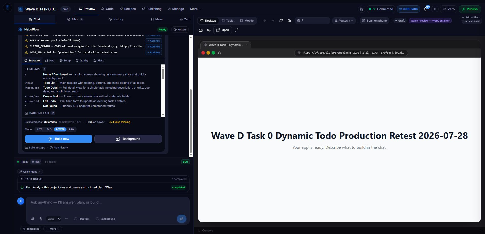
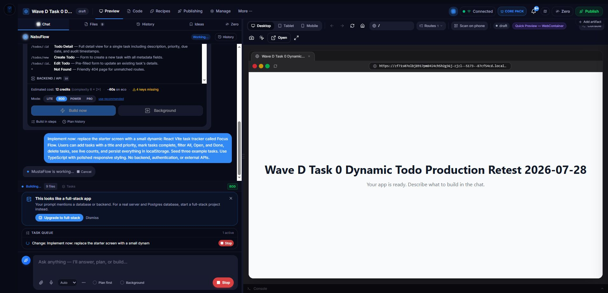
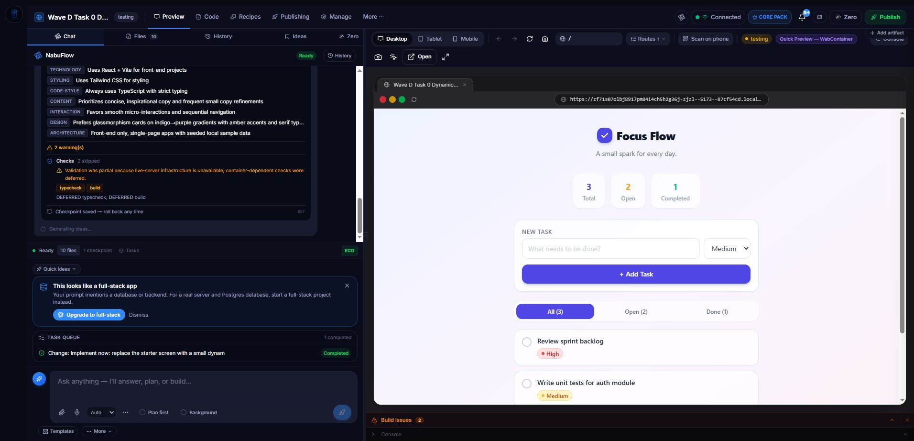

# Wave D Task 0 — Wave C production retest

Date: 2026-07-28  
Production origin: `https://www.mustaflow.com`  
Project: `45` (`Wave D Task 0 Dynamic Todo Production Retest 2026-07-28`)  
Build task: `123`  
Initial planning task: `122`

## Headed-browser UI checks

- The new workspace initialized in `eco`.
- The Deep control was not visible beside the mode picker. The only rendered
  Deep button was inside a `display: none` composer block, so it had a zero-size
  bounding box and was not reachable by pointer or keyboard.
- Because Deep was unreachable, its disabled state in Lite and the expected
  Deep-Eco 3-credit confirmation dialog could not be exercised.
- The one permitted real build therefore ran in standard Eco. The production
  request was:

  ```text
  POST /api/projects/45/messages
  {
    "content": "Implement now: replace the starter screen with a small dynamic React Vite task tracker called Focus Flow. Users can add tasks with a title and priority, mark tasks complete, filter All, Open, and Done, delete tasks, see live counts, and persist everything in localStorage. Seed three example tasks. Use TypeScript with polished responsive styling. No backend, authentication, or external APIs.",
    "agentMode": "eco",
    "planMode": false,
    "deepReasoning": false,
    "background": false,
    "agentIdentity": "main",
    "agentIntent": "build",
    "idempotencyKey": "266f8086-890a-4b0f-87e2-44b5d8c20930"
  }
  ```

Before the build, with Eco selected and no reachable Deep control:


The plan-card Lite selector could be selected, but no adjacent Deep control
appeared to expose or demonstrate its disabled state:



While Task 123 was running:



After the build, with the interactive Focus Flow preview visible:



## Sandboxed command evidence

Task event `3175`:

```json
{
  "eventType": "command_output",
  "runId": "1785271088843:npx tsc --noEmit",
  "status": "running",
  "seq": 0,
  "argv": ["npx", "tsc", "--noEmit"],
  "startedAt": 1785271088843
}
```

Task event `3177`:

```json
{
  "eventType": "command_output",
  "runId": "1785271088843:npx tsc --noEmit",
  "status": "final",
  "seq": 1,
  "argv": ["npx", "tsc", "--noEmit"],
  "exitCode": 1,
  "durationMs": 29,
  "stdout": "",
  "stderr": "/nix/store/17prmkcmwjif1sbpgpfb12dn94psc4gd-npx/bin/npx: line 6: XDG_CONFIG_HOME: unbound variable\n",
  "truncated": false
}
```

The process was genuinely spawned and produced a bounded final observation.
It also exposed a production sandbox defect: the scrubbed environment does not
provide `XDG_CONFIG_HOME`, which the Nix `npx` wrapper requires.

## QA tape evidence

The QA tape did not reach its interactive steps:

- Event `3201`: `qa_step`, message `Starting the QA browser`, data
  `{"kind":"qa_tape_step","phase":"launch","status":"running"}`.
- Event `3202`: `qa_step`, status `failed`, because the Playwright Chromium
  executable was absent at
  `/home/runner/workspace/.cache/ms-playwright/chromium_headless_shell-1223/chrome-headless-shell-linux64/chrome-headless-shell`.
- No clicked/typed human-readable tape steps and no QA screenshots were emitted.

## Completion honesty and self-heal

- Task status: `completed`
- `completionKind`: `finalized`
- Started: `2026-07-28T20:37:13.699Z`
- Completed: `2026-07-28T20:39:41.703Z`
- Elapsed: `148` seconds
- Checkpoint/version: `57`
- Files written: `src/App.tsx`, `src/index.css`, `src/types.ts`
- Terminal event: `Build completed with partial validation — live-server
  infrastructure was unavailable, so container-dependent checks were deferred.`
- The same deferred-validation disclosure was visible in chat and in the
  Builder report.
- No repair/self-heal events were emitted, so there was no spurious repair.
- `/api/credits` returned `1600` before and after this standard-Eco build.
  The requested 3-credit Deep-Eco path was not reachable.
