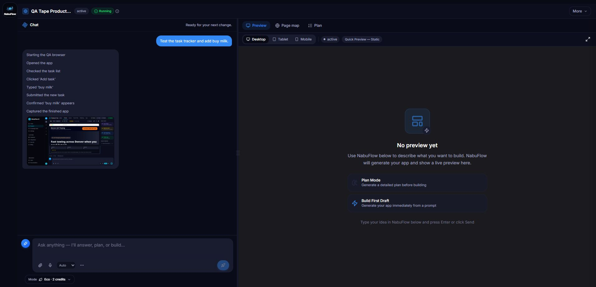
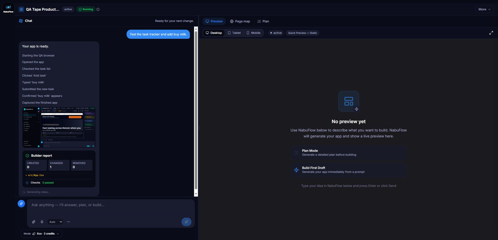

# Wave D.2.1 Task 1 - QA tape in chat

Date: 2026-07-28

## Root cause and fix

The backend already persisted and streamed `qa_step` events whose data has
`kind: "qa_tape_step"`. The former activity bubble knew how to format those
events, but Wave D's simplified project thread no longer rendered that bubble.
The active workspace therefore reduced the run to its calm
`Building your app...` status.

The project thread now uses the existing task-event contract in two ways:

- active task SSE frames are appended live, deduplicated by event ID, and kept
  in event order;
- `GET /api/projects/45/tasks/901/events` reconstructs the same lines from
  persisted history when the report renders after a reload, both in the recent
  thread and in Full history.

No backend route, task-event kind, or event payload changed.

## Production-shaped browser reproduction

A headed browser loaded the real `ProjectWorkspacePage` for project `45`
against a deterministic same-origin API/SSE fixture. The fixture replayed eight
persisted `qa_step` events at 450 ms intervals and attached one bounded JPEG
`take_screenshot` payload to the final step. A temporary dev-auth adapter and
the fixture server were removed before the feature commit.

The live thread showed, in order:

1. `Starting the QA browser`
2. `Opened the app`
3. `Checked the task list`
4. `Clicked 'Add task'`
5. `Typed 'buy milk'`
6. `Submitted the new task`
7. `Confirmed 'buy milk' appears`
8. `Captured the finished app`

The final line displayed the attached screenshot with `max-h-40 max-w-full`.

After the stream completed, the browser was reloaded in the same task. The
assistant report loaded, the task-event history endpoint returned the same
eight records, and the complete tape plus screenshot rendered above the
persisted Builder report:

## Automated checks

- QA parsing and inline renderer: 5 tests passed.
- Live merge assertion: persisted event `1` plus out-of-order live events `3`
  and `2` rendered as `1, 2, 3`.
- Reload assertion: three persisted events rendered with the screenshot and no
  live-event input.
- Mustaflow TypeScript: pass.
- ESLint on Task 1 TypeScript and TSX files: pass with zero warnings.
