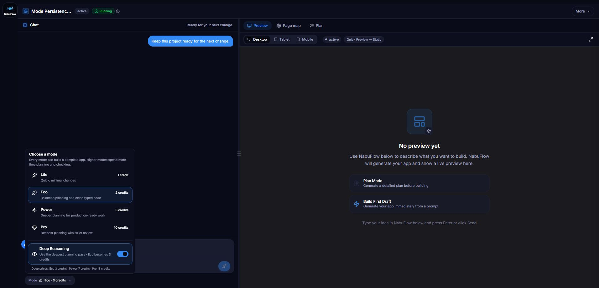

# Wave D.2.1 Task 2 - immediate Mode persistence

Date: 2026-07-28

## Stores used

Mode uses the existing project preference that the send path already writes:

- client request: `PATCH /api/projects/<projectId>` with
  `{ "agentMode": "lite|eco|power|pro" }`;
- authoritative store: `projects.agent_mode`;
- reload source: `GET /api/projects/<projectId>` → `project.agentMode`.

The selection is now PATCHed when the user clicks a mode. The returned project
also replaces the existing React Query project cache immediately.

`deepReasoning` has no project field in the current API contract, and this
hotfix is frontend-only. It therefore reuses NabuFlow's established
per-project browser-preference layer rather than adding a backend field or a
new storage system:

`localStorage["mustaflow_builder_deep_reasoning_<projectId>"] = "1" | "0"`

Lite always writes `0` and loads as `false`, even if an older browser value was
enabled. A project without either preference still starts in Eco with Deep off.

## Production-shaped browser acceptance

A headed browser loaded the real `ProjectWorkspacePage` for project `45`
against a deterministic same-origin project fixture. A temporary dev-auth
adapter and fixture server were removed before the feature commit.

### Power

1. The fresh project loaded as `Eco · 2 credits`.
2. Selecting Power updated the trigger immediately to `Power · 5 credits`.
3. The fixture received
   `PATCH /api/projects/45 {"agentMode":"power"}`.
4. The page was reloaded without sending a task.
5. The trigger and selected panel row still showed `Power · 5 credits`.


### Deep on Eco

1. Eco was selected and Deep Reasoning enabled.
2. The trigger updated immediately to `Eco · 3 credits`.
3. The page was reloaded without sending a task.
4. The trigger remained `Eco · 3 credits`; the Deep control returned with
   `aria-pressed="true"`.



### Lite safety and no-send proof

The same run then selected Lite. Before and after reload:

- trigger: `Lite · 1 credit`;
- Deep: `aria-pressed="false"`;
- Deep control: disabled.

Across Power, Eco + Deep, and Lite, the fixture's final raw counters were:

```json
{ "projectMode": "eco", "projectPatchCount": 5, "messagePostCount": 0 }
```

The final `projectMode` shown in that snapshot was taken after returning to Eco
for the Deep screenshot. No `POST /api/projects/45/messages` fired, so no task
was created during persistence verification.

## Automated checks

- Mode persistence, Mode panel, and follow-up pricing tests: 12 passed.
- Fresh Eco/Deep-off behavior: asserted.
- Per-project Deep persistence: asserted.
- Lite forced-off persistence: asserted.
- Immediate project-update wiring: asserted.
- Mustaflow TypeScript: pass.
- ESLint on Task 2 TypeScript and TSX files: pass with zero warnings.
- Production Vite bundle: pass (4,035 modules transformed).
- Full frontend sweep: 867 tests passed; the one remaining suite failed before
  test collection in the out-of-scope Ora sidebar test because this Windows
  runner rejects `file:///logo.png` as a filesystem path. The same isolated
  suite fails identically on untouched base commit `c7fd27d6`.
