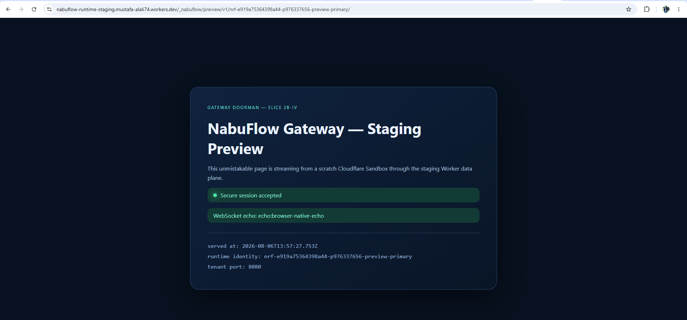
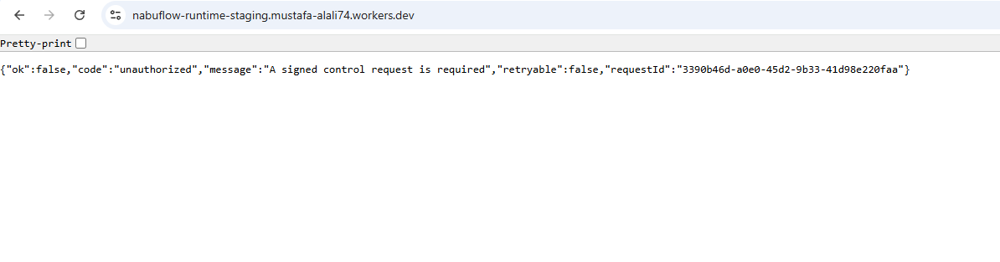
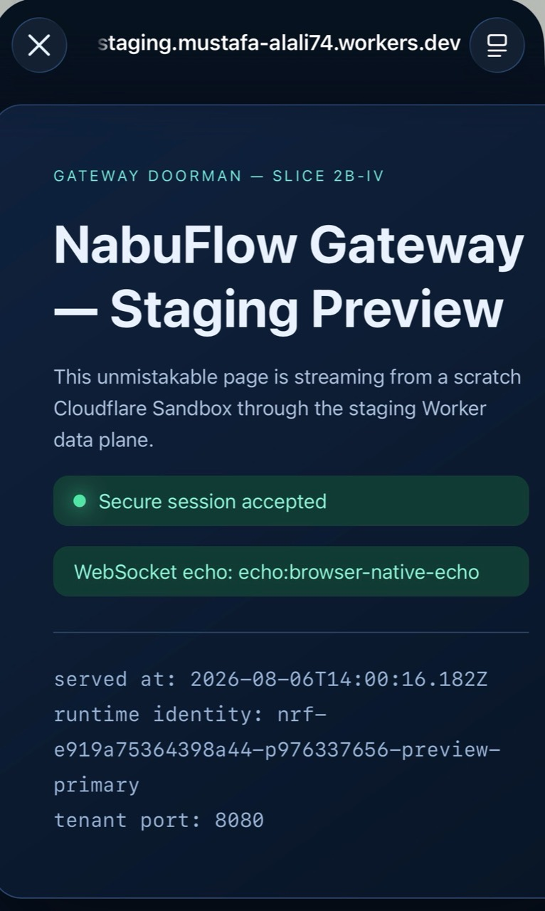

# Gateway Doorman slice 2b-iv — staging acceptance report

- Date: 2026-08-06
- Branch: `codex/gateway-doorman-preview-dataplane`
- Audited base: `d83922e3`
- Staging Worker: `nabuflow-runtime-staging.mustafa-alali74.workers.dev`
- Deployment namespace: `staging`
- Accepted Worker version: `3645e47e-a7d7-4ceb-ad01-58064f4127db`
- Acceptance scratch identity: `nrf-e919a75364398a44-p976337656-preview-primary`
- Tenant service port: `8080`

## Outcome and safety boundary

Slice 2b-iv passed its staging acceptance. An API-side ES256 issuer mints a short-lived,
one-use preview grant only when `TENANT_RUNTIME_PROVIDER=cloudflare`; the Worker redeems
that grant into a host-only Secure/HttpOnly session and streams authenticated HTTP, SSE,
and WebSocket traffic to a scratch Sandbox. The final lab and founder browser checkpoints
both showed the live page and a browser-native WebSocket echo.

This branch was cut from `d83922e3`. It was not merged or published. No Fly resource,
project 27, production machine, Replit production configuration/secret, production DNS,
or custom hostname was touched. The production provider variable remains unset, so the
existing Fly path is unchanged and the grant issuer returns `null` before reading any
Cloudflare preview key material. Only the staging `*.workers.dev` Worker was deployed.

## Pre-flight audit

`git merge-base --is-ancestor 896ca885 d83922e3` returned success. Every commit in the
range was either Ora work, an Ora merge, or Replit publish machinery:

| Commit     | Classification                                |
| ---------- | --------------------------------------------- |
| `fe399591` | Ora fix: isolate conversation transitions     |
| `d6186f57` | Ora fix: enforce artifact-generation honesty  |
| `4e7e8d0d` | Merge PR #8 (`codex/ora-audit-2`)             |
| `4a1f1a8b` | Replit publish marker                         |
| `71fa52fb` | Ora fix: await new conversation before saving |
| `7e5b770b` | Ora fix: enforce requested artifact format    |
| `134fa29d` | Ora fix: auto-save plainly taught memories    |
| `329232ff` | Ora test: bound taught-memory confidence      |
| `2d639354` | Ora fix: clear local stability gates          |
| `c8630326` | Ora test: align release-smoke contracts       |
| `43ecaa65` | Ora test: align durable-memory confidence     |
| `1c10d900` | Merge PR #9 (`codex/ora-audit-3`)             |
| `394851e8` | Replit publish marker                         |
| `69786fc8` | Ora fix: prevent stuck chat transitions       |
| `61b17f79` | Ora formatting for audit fixes                |
| `0fe4045e` | Merge PR #10 (`codex/ora-audit-4`)            |
| `d83922e3` | Replit publish marker                         |

| Ora branch                         | Audited tip | Ancestor of `d83922e3`? | Gateway/doorman overlap requiring a stop? |
| ---------------------------------- | ----------- | ----------------------- | ----------------------------------------- |
| `agent/ora-fresh-start-on-return`  | `e8ea150b`  | Yes                     | No; already merged                        |
| `codex/ora-audit-3`                | `43ecaa65`  | Yes                     | No; already merged                        |
| `codex/ora-audit-4`                | `61b17f79`  | Yes                     | No; already merged                        |
| `codex/ora-runtime-completion`     | `9149d12b`  | Yes                     | No; already merged                        |
| `codex/ora-voice-parity-hardening` | `48b08c77`  | Yes                     | No; already merged                        |

There was no unexplained main movement and no unmerged Ora diff to overlap this slice.

## Implementation

- The contracts package defines the strict ES256 compact-grant envelope, canonical claims,
  maximum ten-minute lifetime, maximum 4 KiB wire size, `nrf-` identity/port scope, and
  WebCrypto-native raw IEEE P1363 signature encoding.
- The API route issues grants only for an explicitly selected Cloudflare provider, only for
  the matching staging preview identity and a non-3000 service port. The private key exists
  only API-side.
- The Worker gives the namespaced control prefix precedence on the `workers.dev` host, then
  resolves preview paths by their contracts-derived `nrf-` identity. The Worker holds only
  the public verify key.
- Grant redemption is GET-only, one-use via Durable Object state, removes the grant query,
  redirects with `Cache-Control: no-store` and `Referrer-Policy: no-referrer`, and sets a
  host-only `Secure; HttpOnly; SameSite=None; Path=/` session cookie.
- Authenticated HTTP requests use `sandbox.containerFetch()` with the original stream as the
  body. Responses preserve their streams, including SSE. WebSocket authentication completes
  first and then passes the exact inbound request to `sandbox.wsConnect(request, 8080)`.
- HTTP hygiene removes the preview/platform cookies, control headers, hop-by-hop headers,
  Cloudflare/control metadata, and client-supplied forwarding headers; trusted forwarding
  fields are rebuilt. App `Authorization` and ordinary app cookies survive. Tenant responses
  cannot set a cookie for `.mustaflow.com` or `.mustaflow.app`.
- The existing Worker-level exception boundary remains authoritative: unexpected failures are
  audited and become typed `503 unexpected_worker_error` responses with `Retry-After: 1`, not
  raw platform errors.

## Local verification

| Gate                                          | Result                   |
| --------------------------------------------- | ------------------------ |
| Contracts unit tests                          | PASS — 6 files, 84 tests |
| Worker unit tests                             | PASS — 3 files, 29 tests |
| API preview-grant tests                       | PASS — 1 file, 4 tests   |
| Contracts, Worker, and API focused typechecks | PASS                     |
| Contracts and Worker focused lint             | PASS                     |
| Repository-wide `pnpm run typecheck`          | PASS                     |
| Repository-wide `pnpm run lint`               | PASS                     |
| Repository-wide `pnpm run format:check`       | PASS                     |
| `git diff --check`                            | PASS                     |

The permanent regression coverage includes the fixed API/Worker ES256 compatibility vector,
provider-unset/Fly inertness, valid/replayed/expired/tampered/wrong-key/missing grants,
unredeemed-cookie rejection, all HTTP methods, large request streaming, unbuffered SSE,
request/response hygiene, authenticated and unauthenticated WebSocket upgrades, control-path
precedence on the staging `workers.dev` host, malformed control signatures (tampered,
truncated, wrong length, invalid alphabet, missing, and oversized), and the top-level typed
exception boundary.

## Staging control authentication matrix

| Probe                   | Status | Typed result        | Evidence                                                    |
| ----------------------- | -----: | ------------------- | ----------------------------------------------------------- |
| Unsigned                |    401 | `unauthorized`      | Clean JSON rejection                                        |
| Tampered signature      |    401 | `invalid_signature` | Clean JSON rejection; no exception                          |
| Expired timestamp       |    401 | `expired_signature` | Clean JSON rejection                                        |
| Valid signed request    |    200 | accepted            | `/_nabuflow/control/v1/version` returned the active version |
| Replay of valid request |    409 | `replay_detected`   | Durable Object nonce consumed once                          |

The control secret propagation gate saw one stale `401 invalid_signature` response and then
accepted the next probe. This is why rotations use atomic `wrangler secret bulk`, followed by
active-version verification and bounded retries.

## ES256 preview authentication matrix

| Probe                     | Status | Typed result / headers                                                                                                | Evidence                                             |
| ------------------------- | -----: | --------------------------------------------------------------------------------------------------------------------- | ---------------------------------------------------- |
| Missing grant and session |    401 | `preview_auth_required`; `WWW-Authenticate: Preview realm="nabuflow-staging"`; `Cache-Control: no-store`              | Rejected before Sandbox access                       |
| Valid one-use grant       |    302 | `Location` without `__nfg`; `Cache-Control: no-store`; `Referrer-Policy: no-referrer`; Secure/HttpOnly session cookie | Follow-up page request returned 200                  |
| Replay of redeemed grant  |    409 | `preview_grant_replayed`                                                                                              | Same URL could not redeem twice                      |
| Expired grant             |    401 | `preview_grant_expired`                                                                                               | Worker-Date-derived clock offset applied             |
| Tampered grant            |    401 | `invalid_preview_grant`                                                                                               | Clean rejection                                      |
| Forged/wrong-key grant    |    401 | `invalid_preview_grant`                                                                                               | Gateway public key cannot mint grants                |
| Redeemed session cookie   |    200 | `Cache-Control: private, no-store`                                                                                    | Reused for HTTP, SSE, WebSocket, and browser refresh |

The fixed compatibility vector proves the canonical header/claims bytes on both sides and a
64-byte raw `r || s` signature. The API signer uses the same WebCrypto contract as the Worker.

## Live data-plane request/response matrix

| Request                              | Status | Relevant response proof                                                          |
| ------------------------------------ | -----: | -------------------------------------------------------------------------------- |
| `GET /`                              |    200 | Authenticated HTML streamed from scratch runtime                                 |
| `POST /echo`                         |    200 | Method and body echoed intact                                                    |
| `PUT /echo`                          |    200 | Method and body echoed intact                                                    |
| `DELETE /echo`                       |    200 | Method and body echoed intact                                                    |
| `GET /sse`                           |    200 | `Content-Type: text/event-stream`; first and second chunks arrived independently |
| WebSocket `/socket`                  |    101 | `Connection: Upgrade`; `Upgrade: websocket`; echo round-trip succeeded           |
| Large streamed `POST`                |    200 | 2,162,688 bytes; exact SHA-256 match                                             |
| Tenant `.mustaflow.com` `Set-Cookie` |    200 | Response `Set-Cookie` absent                                                     |

SSE timing was 47.339 ms to headers, 47.479 ms to the first complete event, and 1,548.827 ms
to the second event. The approximately 1.5-second separation proves the Worker did not buffer
the stream.

Large-body integrity:

```text
sent bytes:     2,162,688
received bytes: 2,162,688
sent SHA-256:   67921e73a5b33b61cfa6ca7bb83a114b4fa159f63145b89da37a34049d5444a5
received SHA:   67921e73a5b33b61cfa6ca7bb83a114b4fa159f63145b89da37a34049d5444a5
match:          true
```

Captured WebSocket transcript:

```text
HTTP/1.1 101 Switching Protocols
Connection: Upgrade
Upgrade: websocket
sent:     nabuflow-websocket-smoke
received: echo:nabuflow-websocket-smoke
```

The first harness upgrade after deployment encountered one intermittent
`401 invalid_preview_grant`; the bounded retry reached `101` immediately afterward. Both real
browsers connected without a visible retry or failure.

## Header, cookie, port, egress, and credential evidence

| Assertion                                | Observed upstream/result                                                         |
| ---------------------------------------- | -------------------------------------------------------------------------------- |
| Preview/platform cookie stripped on HTTP | Upstream cookie was exactly `theme=dark`                                         |
| Injected `X-Forwarded-For` stripped      | Rebuilt from Cloudflare's connecting client address                              |
| Injected `X-Forwarded-Host` stripped     | Rebuilt as the exact staging Worker host                                         |
| Forwarded protocol                       | Rebuilt as `https`                                                               |
| App-level `Authorization` preserved      | `Bearer tenant-app-token` arrived unchanged                                      |
| Control headers stripped                 | `X-NabuFlow-*`, `X-Nrf-*`, and `Idempotency-Key` absent upstream                 |
| Tenant `.mustaflow.com` cookie refused   | No `Set-Cookie` in gateway response                                              |
| Tenant service port                      | `8080` (reserved port 3000 rejected by contract/tests)                           |
| Container credential-name audit          | `none`                                                                           |
| Egress probe                             | External response `status=520`, proving the configured outbound path was reached |

For WebSocket upgrades only, workerd requires the exact original Request object. The Worker
authenticates the redeemed session before connecting, but the tenant handshake therefore sees
the preview/platform cookies and client forwarding headers. That deliberate exception is
documented in code and is called out as a pre-publication concern below.

## Browser evidence

The exact staging host was already present in Chrome's per-site permission list. No broader
`*.workers.dev` rule and no OS/managed-policy entry was added. The entry can be found and
removed under Chrome's site settings for
`nabuflow-runtime-staging.mustafa-alali74.workers.dev`.

Lab Chrome — authenticated page, address bar, secure session, and native WebSocket echo:



Lab Chrome — unauthorized bare-host request rejected with a typed 401:



Founder phone — one-use grant redeemed, authenticated page visible, and native WebSocket echo:



The grant-bearing URL is intentionally absent from this report. The founder session survived
the grant-removing redirect; the founder supplied the screenshot above after confirmation.

## Lifecycle, cleanup, and billing

The acceptance lifecycle completed `ensure`, `start`, `status`, authenticated data-plane
traffic, `exec`, logs, `stop`, and finally `destroy`. Destroy returned `200 {"ok":true}`.

Post-destroy readout:

```text
application: a03c7bfa-dbd1-44ef-9fb2-38a00327ee0c
configured instances/max_instances: 5 / 5
health.active:   0
health.assigned: 0
health.healthy:  5
scratch state:   inactive
scratch location: -
scratch version:  -
```

Every listed instance record was inactive and had neither a location nor a running version.
Wrangler's `LIVE INSTANCES = 5` label correlated exactly with configured capacity and healthy
application records, not running tenant containers: the authoritative runtime counters were
`active=0` and `assigned=0`. These inactive records are the expected tombstone/capacity noise;
no further deletion was attempted.

The account billable-usage view, checked after cleanup for the Jul 30–Aug 6 observed portion of
the August cycle, showed total cost `$0.00`, projected cycle cost `$0.00`, and average daily
cost `$0.00`. It showed 63 cumulative container vCPU-seconds for the billing period at `$0.00`
(plus cumulative included-tier memory/disk/egress counters). The billing UI is account- and
cycle-aggregated rather than scratch-identity-specific, so it cannot attribute those 63 seconds
to one sandbox; combined with `active=0`, `assigned=0`, and all-inactive records, there is no
running container or ongoing accruing cost after cleanup.

## Clock and propagation observations

The Worker `Date` header was `Thu, 06 Aug 2026 13:55:26 GMT`. The derived lab-to-Worker offset
was `-11,811,769 ms`, consistent with the known lab clock being about 3h17m ahead. Expired and
valid probes classified correctly after applying that derived offset.

The earlier bounded propagation experiment remains the platform baseline: 0 ms observed 1101
window across eight rotations and 2,310 probes; secret-update operations took approximately
2.3–2.6 seconds, and secret-plus-upload operations approximately 5.8 seconds. The later
intermittent stale-key rejections show that a single successful probe is not a sufficient
version-convergence signal.

## Root-cause record

### ES256 encoding

Node's default ECDSA output is ASN.1/DER (usually 70–72 bytes with a `0x30` prefix), while
Workers WebCrypto verifies raw IEEE P1363 `r || s` (64 bytes). The first harness/API signing
path used the Node default, so every otherwise-valid grant failed while the envelope-specific
negative cases still classified correctly. The contract now standardizes on WebCrypto-native
raw P1363, includes a fixed canonical-payload/key/signature vector, and tests it at the
contracts, API issuer, and Worker verifier boundaries. The API-side minting code required and
received the same fix; without it, later production grants would fail identically.

### Secret versioning and atomic rotation

Sequential `wrangler secret put` calls create independently deployable versions, and a later
Worker deployment can silently reactivate an older secret set. That produced persistent
control 401s even though individual rotations appeared successful. The standing rule is to
deploy code first, atomically update the complete secret set with `wrangler secret bulk`, then
verify the active Worker version and run sustained authentication probes. Production must use
the same atomic-bulk rule.

### WebSocket original-request mutation

The hygiene layer initially rebuilt every inbound Request. In workerd, the WebSocket upgrade
state is attached to the original Request; passing a reconstructed Request to `wsConnect`
threw, and the top-level boundary correctly converted it to typed
`503 unexpected_worker_error`. The Worker now authenticates first and passes the exact original
upgrade Request. A regression test proves object identity and an authenticated echo, while an
unauthenticated upgrade is rejected before `wsConnect`.

### Intermittent stale propagation

Staging isolates occasionally served an older preview public key even after consecutive valid
probes. That explained isolated `invalid_preview_grant` responses without implicating the
grant/session branch itself; a real browser and the next bounded harness attempt succeeded.
Acceptance now requires sustained success and retries only the narrow, typed propagation class.
This mitigates user-visible transients but does not replace proper key-version overlap.

### Harness CRLF framing

The scratch echo server used a raw template string containing doubled `\\r\\n`, emitting
literal backslash characters instead of HTTP/WebSocket CRLF delimiters. Cloudflare could not
parse the tenant's 101 response even though gateway routing was correct. Correct CRLF framing
fixed the echo, and the final harness plus two native browsers proved the full upgrade path.

## pnpm installation incident

The hang was environmental rather than a source-tree conflict. Disk headroom was ample,
`registry.npmjs.org` returned HTTP 200, and the main checkout and worktree resolved identical
unset `store-dir`, `virtual-store-dir`, and `node-linker` values to the same absolute pnpm v10
store. The shared store's status check exposed an inconsistent/missing index entry, while the
first interrupted run had left an incomplete worktree-local `node_modules`. Clearing only that
worktree-local partial link set and reinstalling from the absolute store completed normally;
the shared dependency junction was never altered. The pinned packages were then physically
present: `@cloudflare/sandbox@0.12.4`, `@cloudflare/containers@0.3.7`, and
`wrangler@4.118.0`. A local Wrangler dry-run bundled the Worker successfully, and the same
imports powered the accepted staging deployment. A bare Node 24 ESM import is not a valid
runtime check for these Worker packages: `@cloudflare/containers@0.3.7` publishes an
extensionless internal import that bare Node rejects, although Wrangler/esbuild and workerd
resolve it. This packaging limitation and the store inconsistency are both worth retaining as
lab-environment notes.

## Secret and diagnostic hygiene

All staging secret values were held only in the process/session environment and sent with
atomic secret bulk. They were never printed, written to the worktree, or committed. The test
private key in the fixed vector is deliberately public test data and is labeled as such.
`tmp/` and diagnostic output paths are covered by repository ignore rules, and the history
audit found no staging token value in any commit.

## Recommendation before 2b-v

The HTTP/SSE design is suitable to carry forward, but the design needs two explicit adjustments
before published routing faces real users:

1. Add key identifiers plus overlapping old/new public verification keys (or an equivalent
   atomic version-pinning mechanism). Sustained probes and retries are useful defenses, but
   they should not be the primary rotation protocol.
2. Resolve the WebSocket hygiene exception. Today auth-before-connect is sound, but the tenant
   WebSocket handshake sees platform cookies and client-supplied forwarding headers because
   workerd rejects a rebuilt Request. Obtain a Cloudflare-supported way to preserve upgrade
   internals while supplying sanitized headers, terminate/re-originate the WebSocket at a
   boundary that can do so, or explicitly accept and threat-model the exposure before 2b-v.

Also add first-class per-runtime active/cost telemetry: Cloudflare's billing page is aggregated
and Wrangler's `LIVE INSTANCES` label is misleading in the presence of inactive records.
Finally, consider host-per-preview session isolation before broad rollout. The current
identity-specific `__Host-` cookie names are safe for this staging slice, but one shared
`workers.dev` host accumulates one cookie per runtime and broadens cookie exposure on the
documented WebSocket exception.

With those changes treated as a pre-publication gate, the authenticated data plane itself has
enough concrete staging evidence to proceed toward 2b-v planning. It should not yet receive
production traffic.
